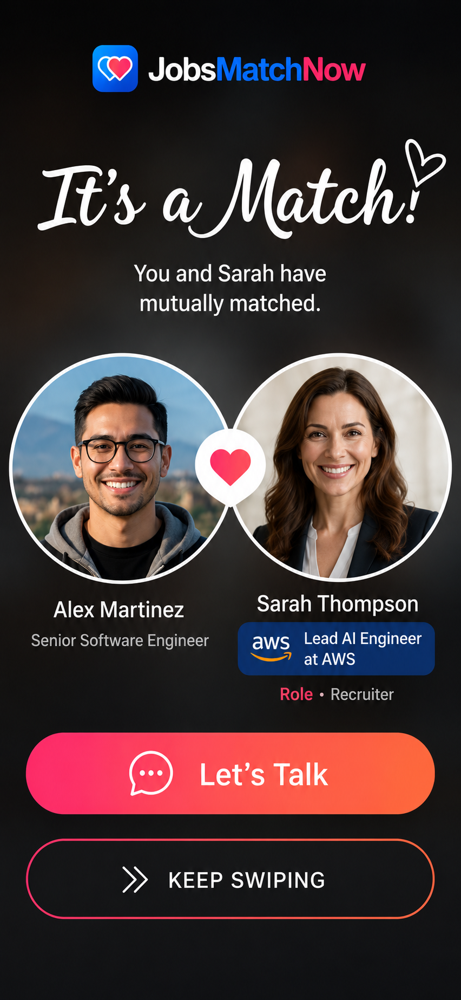
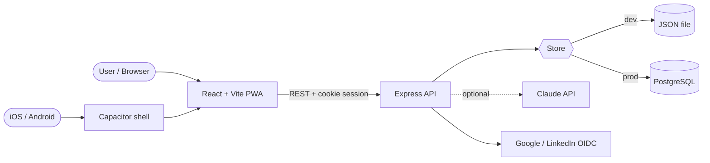

<div align="center">


# JobsMatchNow

### Stop chasing jobs and candidates. Let the perfect match chase you.

**A two-sided, mutual-intent hiring platform — swipe-to-match discovery, explainable fit scores, and salary-up-front transparency, so a conversation only opens when _both_ sides choose.**

[](https://jobsmatchnow.com)
[](https://jobsmatchnow.com/app/)


<br />



</div>

---

## 💡 Why JobsMatchNow

Hiring today creates **activity**, not **alignment**. Candidates fire off dozens of applications into the void; recruiters drown in unqualified inbound. Everyone loses time and signal.

JobsMatchNow flips it. Modeled on the mutual-intent mechanics that made dating apps work, **a connection only opens when both sides swipe right** — so every conversation is one both people actually want.

| Old hiring | JobsMatchNow | What changes |
|---|---|---|
| Search boxes & job-board scrolling | A personalized card deck ranked by skills, goals, location & work style | **Less noise** |
| CV keyword filters & recruiter guesswork | A transparent **0–100 fit score** with matched-skill evidence | **Better decisions** |
| Repeated forms, cover letters, re-uploads | One complete profile + a single intentional swipe | **Minutes, not hours** |
| One-way applications & cold outreach | A chat opens **only after both sides choose** | **Mutual intent** |
| Personal details copied across portals | Candidate-controlled visibility; contact hidden until a match | **Consent first** |
| Salary discovered late (or never) | **Salary is up front** — revealed to both sides on match | **No games** |

> _Illustrative product targets from the demo experience: **3.2×** more qualified conversations · **48h** median time to first response · **42%** fewer screening steps._

---

## 🧭 The journey — register to signed contract

```
① Register free → ② Build profile → ③ Get matched → ④ Mutual interest
      → ⑤ Start chatting → ⑥ Interview → ⑦ Offer → ⑧ Sign the contract
```

Everything from a first swipe to a signed offer lives in **one** respectful, intelligent experience — with coaching built into every step.

---

## ✨ Features

### For candidates
- 🔥 **Swipeable role deck** with drag gestures, Super Like, and Rewind
- 🎯 **Explainable fit score** — a flip card breaks down skills, seniority, salary overlap, distance, and work-mode fit with evidence lines
- 📄 **Resume upload → auto-fill** — drop a PDF/DOCX and your profile fills itself in
- 💰 **Salary sanity badges** pre-match ("within your range" / "below your minimum"); exact ranges revealed to both sides on match
- 📍 **Geolocation of opportunities** — real distance matching; meet for coffee in your city, exact location never exposed
- 🧑‍🏫 **Interview prep** per role, and a **fit-gap coach** that recalculates your score live when you add a skill

### For recruiters & headhunters
- 🃏 **Talent discovery deck** with full-bleed candidate cards
- 📋 **Job posting builder** with weighted required skills, work-mode options (remote worldwide / within-country / hybrid radius), mandatory salary, and cover images
- 🤖 **Import a job** by pasting a URL/text or uploading a description file — parsed into structured fields
- 📥 **Screening questions** answered by candidates on right-swipe, shown on the pipeline card
- 🗂️ **Hiring pipeline** (kanban) with idle-match nudges and auto-generated **interview kits**
- 📊 **Insights** on match quality, response rate, and funnel

### Shared
- ❤️ **Mutual match → chat → interview scheduling**, with confetti on the "It's a Match" moment
- 🔐 **Real auth**: email + password, plus **Google & LinkedIn SSO** (OpenID Connect), with signed HttpOnly sessions
- ✅ **Verified badges**, "Looking for" intent pills, and a colorful Apple-system-color card design
- 🌐 Responsive web + installable PWA + **iOS & Android** (Capacitor)

---

## 🏗️ Tech overview

**Frontend** — React 19 + TypeScript + Vite, [`motion`](https://motion.dev) for gestures/animation, `lucide-react` icons, `pdfjs-dist` for the in-app resume viewer. Zero UI framework — hand-built, theme-aware CSS.

**Backend** — Node.js + Express REST API. Pure, unit-tested matching & validation logic. Auth uses `node:crypto` scrypt password hashing and HMAC-signed session cookies — **no external auth dependency**.

**Data** — a zero-dependency JSON file store for local dev, swapped for **PostgreSQL** in production behind a single `DATABASE_URL` env var (same interface, durable storage).

**AI-optional** — resume/job parsing and interview coaching use the Claude API when `ANTHROPIC_API_KEY` is set, and fall back to a solid heuristic/template engine otherwise. **The whole demo runs with no external network calls.**

**Mobile** — Capacitor packages the web app for iOS/Android; an Expo QR launcher gives instant phone previews.



### The matching engine
A candidate↔job **fit score (0–100)** is a weighted blend, stored with a per-factor breakdown so the UI can explain every match:

| Factor | Weight |
|---|--:|
| Weighted skill overlap | 40% |
| Seniority match | 15% |
| Salary-range overlap | 15% |
| Distance vs. both radii | 10% |
| Work-mode compatibility | 10% |
| Employment-type match | 10% |

---

## 🚀 Getting started

```bash
# install
npm install

# run the full stack (API on :3001 + Vite web on :3000)
npm run dev
#   → open http://localhost:3000

# or use the guided launcher (desktop / mobile / production)
./startdemo.sh
```

The app seeds itself with demo candidates, recruiters, and jobs on first run — **no config or credentials required**. Log in instantly by picking a demo profile, or register a real account.

```bash
npm run lint     # typecheck (tsc)
npm test         # server unit tests (matching, auth)
npm run build    # production web build
```

**Optional integrations** (set as env vars — everything degrades gracefully without them):

| Variable | Enables |
|---|---|
| `DATABASE_URL` | PostgreSQL storage instead of the JSON file |
| `SESSION_SECRET` | Signed session cookies (required in production) |
| `GOOGLE_CLIENT_ID` / `_SECRET` / `_REDIRECT_URI` | Real Google SSO |
| `LINKEDIN_CLIENT_ID` / `_SECRET` / `_REDIRECT_URI` | Real LinkedIn SSO |
| `ANTHROPIC_API_KEY` | Claude-powered parsing & coaching |
| `DEMO_AUTH` | Keep demo logins alongside real accounts |

---

## 📁 Project structure

```
src/                 React web app (landing + candidate/recruiter workspace)
  components/          swipe cards, wizards, coaching, auth, landing sections
  lib/                auth, geolocation, colors, pdf rendering
server/              Express API
  matching.js         pure fit-score + mutual-match logic (unit-tested)
  auth.js             scrypt hashing + rate limiting
  profile.js jobs.js  profile & job models
  resume*.js coaching.js  parsing + coaching (Claude-optional)
  integrations/       Google/LinkedIn OIDC adapters
marketing/           standalone marketing site (jobsmatchnow.com)
mobile-expo/         Expo QR preview launcher
deploy/              AWS + EC2 deployment scripts
```

---

## ☁️ Deployment

Two tiers, same codebase, no rebuild:

- **Cheap MVP tier** — everything on a single EC2 (nginx + systemd API + local PostgreSQL + daily backups). ~$10/mo.
- **Managed production tier** — CloudFront + S3 web, ECS Fargate API, RDS PostgreSQL, Secrets Manager. Scripts in `deploy/aws/`.

Live at **[jobsmatchnow.com](https://jobsmatchnow.com)** · web app at **[/app](https://jobsmatchnow.com/app/)**.

---

<div align="center">

**Perfect matches should feel human.**

Built with React, Express, and mutual intent.

</div>
